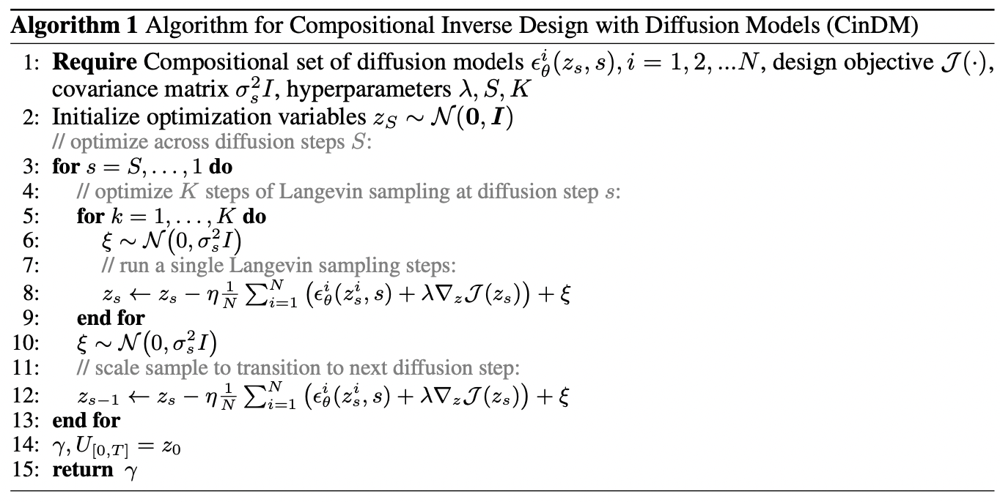
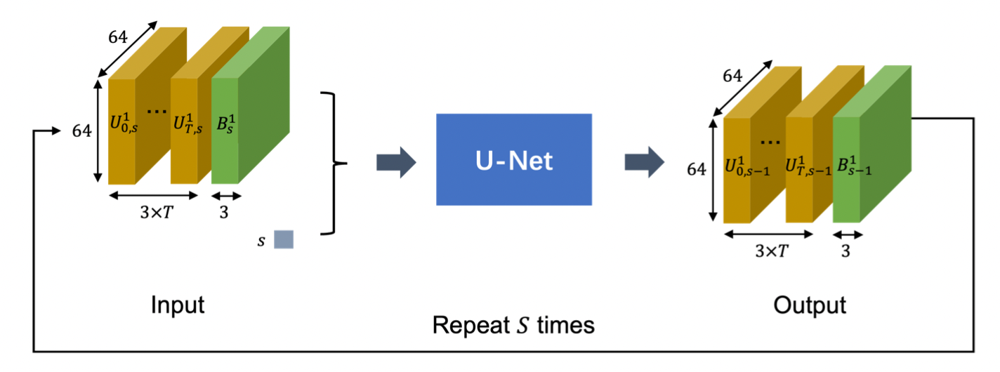

# 论文【2024】：构造生成式逆向设计

## 概述

1. 逆设计 $\rightarrow$ 给定目标（例如升力/阻力最优、能量最小），反过来求解系统的输入（初始条件、边界形状等）。
2. 把逆设计问题表述为能量最小化，生成隐含了 “**什么样的解是物理可行的**” 的能量函数（来自扩撒模型），设计目标 = 物理一致性 (由能量约束) + 设计目标。（保证优化时不会跑到分布外）
3. 每个子扩散模型学一个子空间（一个翼片、两个物体的相互作用等）。

> **传统逆设计** = surrogate + 反向传播，容易 OOD。(DiffAirfoil 里在测试阶段用了，但不参与训练)
>
> **本文方法** = 扩散模型能量函数 + 组合优化 $\rightarrow$ 保证分布内

## 注解

1. 为什么约束能用损失表示、并且可微？

   > 升力 $C_L(U_t,B)$ 和 阻力 $C_D(U_t,B)$ 都是关于轨迹的可微函数，但是因为这些都是软约束所以就会有 surrogate 模型超出分布范围（设计范围）的情况出现 

## 笔记

1. **正向问题：** 给定形状 → 解 PDE → 得到性能；
    **逆向问题：**给定性能 → 求形状 

   >  高维非凸优化问题。

   

2. 问题设定

   - 偏微分方程表达动力系统：$u(x,t;\gamma) $ $\rightarrow$ 位置+时间+边界限制条件

   - 待优化设计参数：$\gamma=(u_0,\mathcal{B})\in \Gamma$ $\rightarrow$ 初始条件+边界条件

   - 反设计问题：$\hat{\gamma}=\arg \underset{\gamma}{\min}{\mathcal{J}}(u(\gamma),\gamma)$ $\rightarrow$ $\gamma$ 作为限制条件一方面影响动态轨迹影响进而间接影响设计目标，另一方面直接作为参数影响

   - 对于设计参数 $\gamma\in\Gamma$ 有一个观察到的路径 $U_{[0,T]}(\gamma)=(U_0,U_1,U_2,...,U_T)$ 

     - **$\gamma$** 设计参数 = 可调输入，比如几何边界、初始条件、边界条件。

     - $u$ 轨迹 = 固定输入条件下，系统随时间演化出的解（流场、动力学轨迹）。

       >  「合理的物理解」+「可控的设计变量」 $\rightarrow$ 二者联合建模。

   ------

   方案一：学习一个神经代理模型 $f_{\theta}$

   - $\hat{U_t}(\gamma)=f_\theta(\hat{U}_{t-1}(\gamma), \gamma),\quad\hat{U}_0:=U_0, \quad\gamma=(U_0, \mathcal{B})$

   

3. 生成式反设计

   方案二：扩散模型训练【轨迹 + 设计参数】的联合分布

   $E_\theta$：能量函数，由扩散模型学得 $\rightarrow$ 真实的数据分布能满足  $p(U_{[0,T]},\gamma)∝e^{-E_\theta(U_{[0,T]},\gamma)}$

   > 如果某个轨迹 + 边界组合是真实的（比如 CFD 解），那么 $E_\theta$ 就会给它比较低的值，概率就高

   $\hat{\gamma}=\arg\underset{\gamma,U_{[0,T]}}{\min}[E_\theta(U_{[0,T]},\gamma)+\lambda\cdot\mathcal{J}(U_{[0,T]},\gamma)] $

   > 同时优化生成式目标和设计目标，$E_\theta$ 同时优化轨迹和设计参数
   >
   > > $z_{s-1} =z_s - \eta \Big( \nabla_z E_\theta(z_s) + \lambda \nabla_z J(z_s) \Big) + \xi, 
   > > \qquad \xi \sim \mathcal{N}(0, \sigma_s^2 I).$

4. 组合式生成逆设计【<u>仅用于推理阶段</u>】

   **推理/采样技巧**：全局能量函数拆成局部能量子函数，然后在推断时组合起来

   能量函数拆解：$E_{\theta}(z)=\sum_iE_{\theta}(z_i)$

   泛化类型1：短到长时步泛化

   > 把多个短窗口能量拼接

   泛化类型2：双体到多体交互泛化 （一般情况下训练单体即可，如果涉及 N 体问题直接训练双体问题就可以扩展到 N 体）

   > 把 pairwise 的 2-body 能量叠加
   >
   > $E_\theta (U_{[0,T]},\gamma)=\underset{i<j}{\sum}E_\theta((U_{[0,T]}^{(i)},U_{[0,T]}^{(j)}),\gamma)$
   >
   > 能量可加，所以不用重新训练，比如如果是三体模拟的话就是1&2和2&3的组合能量叠加

   泛化类型3：从部件边界到整体系统的泛化

   > 相比 “两体$\rightarrow$多体” 是把双部件专家做 PoE，“部件$\rightarrow$整体” 是把单部件专家做 PoE
   >
   > $E_\theta (U_{[0,T]},\gamma)=\underset{i=1}{\sum}E_\theta((U_{[0,T]},\gamma^i)$ 
   >
   > > 所有的零件设计参数 $\gamma^i$ 共享同样路径 $U_{[0,T]}$（合理的，比如一架飞机上各个部件都会影响周围相同流体的整体状态。

