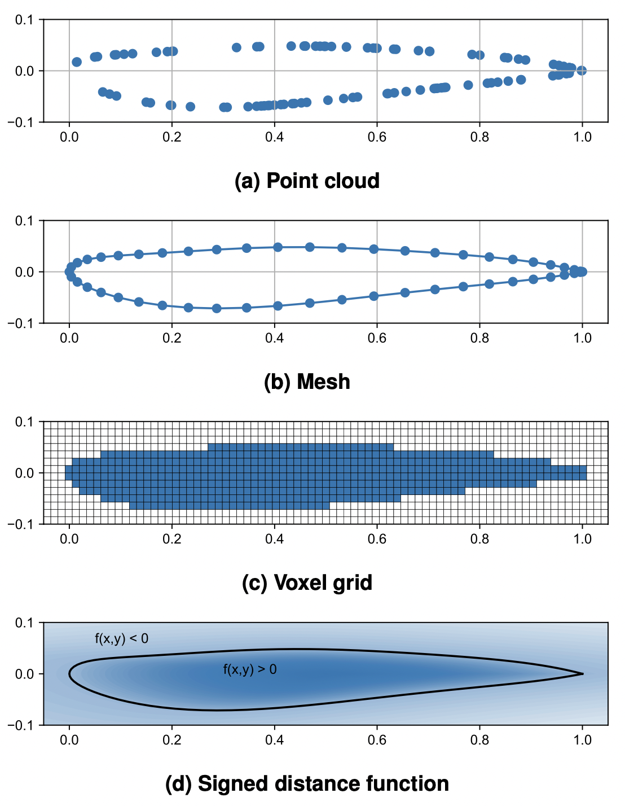
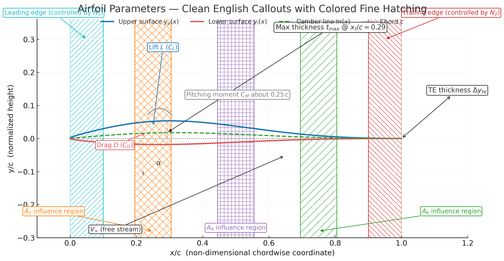
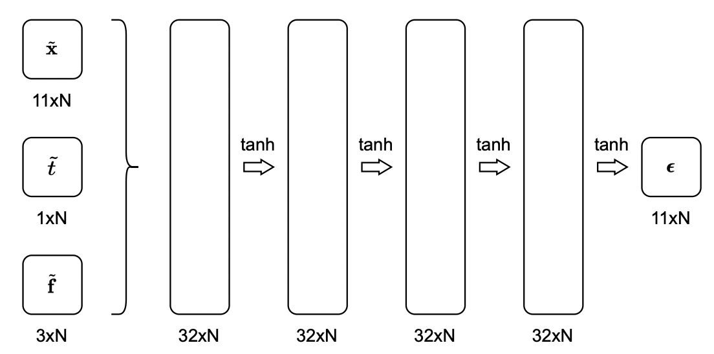

# 论文【2024】：基于概率扩散模型的空气动力设计

## 概述

1. 按条件（升力、阻力、力矩等特征/约束）合成二维翼型，即使相同约束也能给出多种候选翼型

2. 几何采用 Bernstein 多项式参数化，天然保证生成曲线平滑、可物理

3. 为什么光滑？：翼型尖角/锯齿会在压力分布里制造非物理峰值，导致 XFOIL/CFD 不收敛或气动性质失真，所以选 Bernstein 多项式参数化。

4. UIUC 数据库为已优化翼型，不适合开发新类型

   

   *仅对升力系数、阻力系数和力矩系数进行约束处理

   

## 笔记

1. 两类 ML 加速思路：

   - **降维/潜空间**：压缩到更小的潜空间，只需关注那块可行子空间（大多数参数组合不物理）
   - **代模型**：用代理模型近似高保真仿真，减少每次评估的成本

   

2. 四种方式描述几何参数（二维翼型）：abc 三种方法均不连续 $\rightarrow$ 生成的几何体仅具有有限分辨率

   

3. Bernstein polynomials：平滑且连续的参数化方法

   参数曲线基函数 $\phi_i(t)$ 满足：

   1. **非负性**：$\phi_i(t)\ge0$，避免曲线跑出控制点凸包。
   2. **归一化**：$\sum_i \phi_i(t)=1$，保证曲线是控制点的凸组合。
   3. **端点插值**：P(0)=P0,  P(1)=Pn。
   4. **平滑性**：连续可导，控制点能自然影响曲线。
   5. **数值稳定**：随次数 n 增大，曲线越来越逼近控制点序列的“形状”。

   

4. CST（Class–Shape Transformation）翼型参数化：类函数 × 形状函数

   $\rightarrow$ $\dfrac{y}{c}=(\dfrac{x}{c})^{N_1}(1-\dfrac{x}{c})^{N_2} \cdot B_n(\dfrac{x}{c})$ ; $B_n(\dfrac{x}{c})=\sum A_i\cdot C_n^i\cdot (\dfrac{x}{c})^i(1-\dfrac{x}{c})^{n-1}$

   > $N_1,N_2$ 控制前缘/尾缘的边界光滑性；$A_i$ 作为每个 Bernstein 基函数的权重，控制相应区域凹陷/凸出

   

​		样本向量：$x=\{\underbrace{A_{l,0},A_{l,1},A_{l,2}...,}_{6个上界面}\underbrace{A_{u,0},A_{u,1},A_{u,2}...}_{6个下界面}\}$ $\rightarrow_{A_{u,0} = A_{l,0}}$ X$\in \mathcal{R}^{11}$

5. 用 XFOIL 得到 $\mathbf{f}=(C_L,C_D,C_M)$ 气动条件。

   
