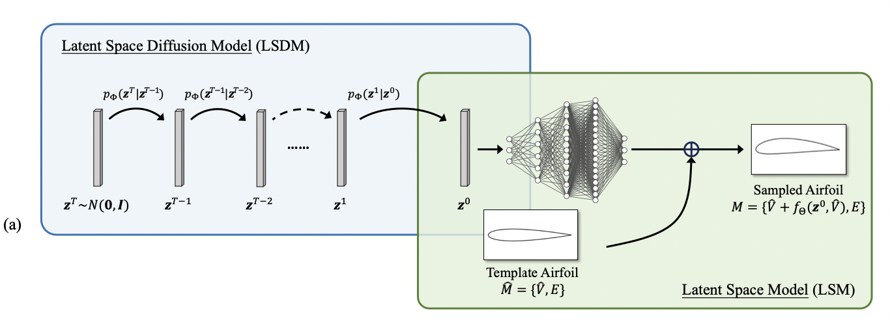
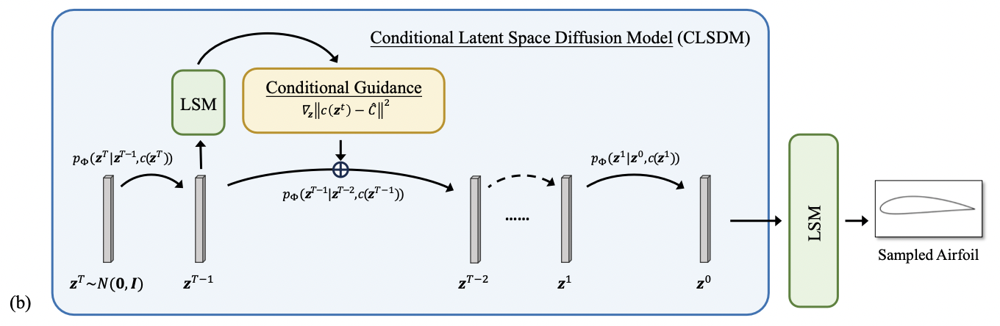
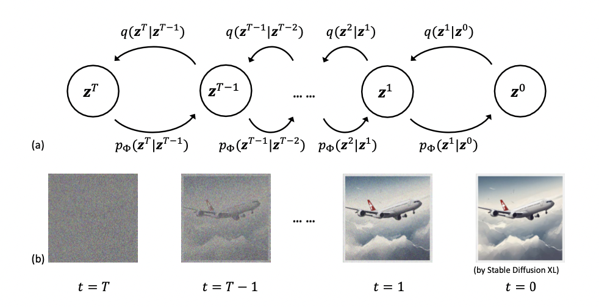
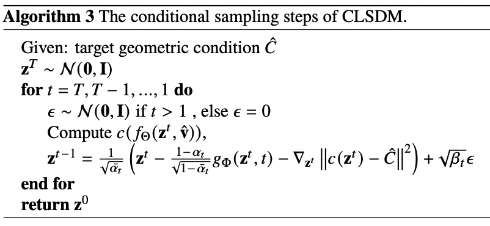

# 论文【2024】：基于隐空间的空气动力学形状优化

## 概述

1. **在隐空间扩散**：直接在几何点云/控制点空间采样很难保证翼型基本形状。LSM 先学到一个低维、结构化的隐空间，天然编码了基础翼型的几何先验；再在这个空间里做扩散，既稳又少数据，而且采样出来的一解一解几乎都是有效几何

## 注解

1. 正向传播为什么 $z_t=\sqrt{\alpha_t}\cdot z_{t-1}+\sqrt{1-\alpha_t}\cdot\epsilon_t$ ?

   > $\mathrm{Var}(aX+bY)=a^2\mathrm{Var}(X)+b^2\mathrm{Var}(Y)$（独立情况下），令 $a=\sqrt{\alpha_t}$, $b=\sqrt{1-\alpha_t}$
   >
   > 保证 $z_t$ 均值为0，方差为1

   

## 笔记

1. 无条件版（LSDM + LSM）

    $M=\{\hat V+f_\Theta(z_0,\hat V),\hat E\}$ $\rightarrow$ 把潜码 $z_0$ 解码到模板翼型 $\hat M=\{\hat V,\hat E\}$

   

2. 有条件版（CLSDM）

   在反向去噪时，沿着“让几何指标更接近目标”的方向微调潜码，从而在不改网络、不加新数据的前提下，实现条件可控。

   

3. **LSM：Latent Space Model** 隐空间自动参数化 : $f_{\Theta}: R^d \times R^2\rightarrow R^2$, $\delta v=f_\Theta(z,\hat{v})$

   > z 决定变的方式，$\hat{v}$ 提供变的位置。
   >
   > $L_{CD}$ 指的是 Chamfer Distance（柴姆弗距离）损失，用来度量两条曲线/两组点的形状相似度

   - Training Time:

     $\Theta^*,z^*=\sum^k argmin_{z,\Theta}\mathcal{L}_{LSM}(\hat{V}+f_{\Theta}(z,\hat{V}),S)$ , where $\mathcal{L}_{LSM}(V,S)=\mathcal{L}_{CD}(V,S)+w|z|^2_2$

   - Inference Time（冻结 $\Theta$）:

     $z^*=argmin_{z}\mathcal{L}_{LSM}(\hat{V}+f_{\Theta}(z,\hat{V}),S)$ $\rightarrow$ 冻结 Θ，给定新翼型 S，只优化 z 使 $V(z)$ 贴合 S。

     > $S_k$ 是翼型统一道模版坐标系（弦长=1且上下表面取相同的点），迭代 k 步得到最终图 $z_k$ （新翼型在隐空间表示）

   **训练 LSM**：学会从潜向量 $z$ 解码到翼型 $V(z)$。

   

4. **LSDM：Latent-Space-Based Diffusion Model for Unconditional Sampling** 

   > 把高斯噪声逐步去噪为“有效潜码 $z_0$，再由 LSM 解码成翼型

   

   > 把  {$z_k^*$} 当作真实数据分布来训练扩散模型 $g_\Phi$。
   >
   > 之后采样得到新的 $z^0$，再交给 LSM 解码成新翼型。

   

5. **C LSDM：The Conditional Latent-Space-Based Diffusion Model**

   > 工程里常要指定几何目标（面积 A、最大厚度 MT 等）。
   >
   > CLSDM 的目标：**在不改网络、不加数据的前提**，让采样结果满足用户给的几何指标（“插件式条件”）
   >
   > $\rightarrow$ CLSDM = 已训练好的 LSM + 已训练好的无条件 LSDM + 采样阶段注入“几何对数似然”的梯度引导

   - 任一条件 $c(z)$ 建一个高斯似然 : $p(c(z)|z,\hat{C})=\mathcal{N}(c(z);\hat{C},\sigma^2_c)$

   - $\nabla \log(p(c(z)|z,\hat{C}))$  $\rightarrow$ 各个条件独立 $\rightarrow$ 概率空间相乘 $\rightarrow$ 对数空间求和

     

     >  **反向过程**：$p(z_{t-1}|z_t)=\mathcal{N}(\mu_t,\beta_tI)$  $\rightarrow$ **反向均值**：$\mu_\phi(z_t,t)=\dfrac{1}{\sqrt{\alpha_t}}(z_t-\dfrac{1-\alpha_t}{\sqrt{1-\alpha_t}}g_{\phi}(z_t,t))$

     $\mu_t=\dfrac{1}{\sqrt{\alpha_t}}(z_t+\beta_ts_t)$ ,  

     > where $s_t^{(uncond)}=\nabla_{z_t}\log{(p(z_t))}$
     >
     > where $s_t^{(cond)}=\nabla_{z_t}\log{(p(z_t))} + \nabla_{z_t}\log{(p(cond| z_t))}$
     >
     > 将 $s_t$ 代入 均值后得到 $\phi: z^t\rightarrow z^{t-1}$  更新公式

     

6. 完事之后用 surrogate（没有说具体的模型架构）预测 $C_L,C_D$ ，筛选之后放入 CFD 高保真验证，避免每次都跑 XFOIL/CFD
